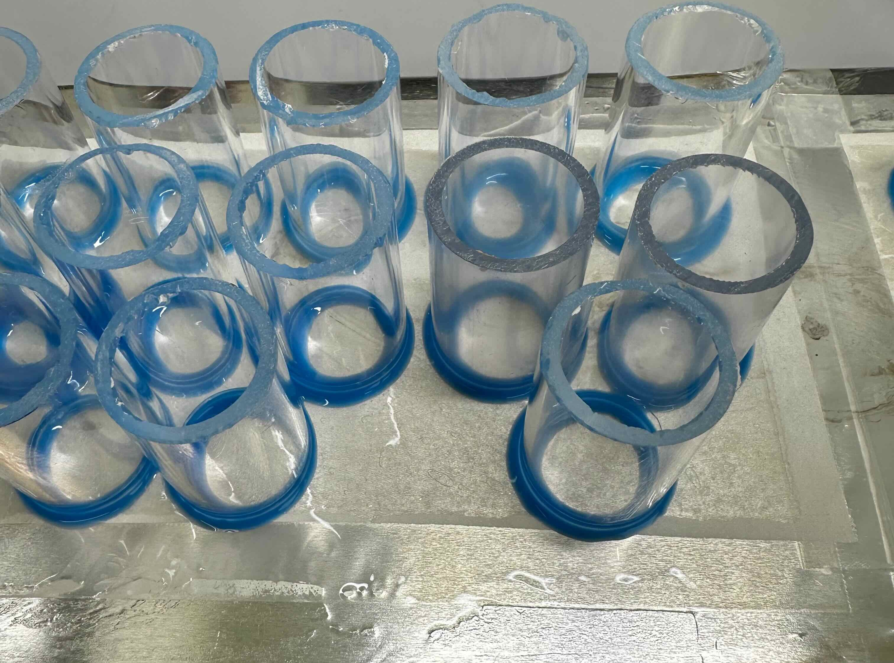

::: callout-important
## Safety Requirements

-   Wear **gloves, lab coat, and safety goggles** at all times.
-   Treat bovine blood as **potentially biohazardous material**.
-   Handle blood inside a **Class II biological safety cabinet**.
-   Disinfect working surfaces before and after use with **70%
    ethanol**.
-   Dispose of biological waste according to **institutional biosafety
    regulations**.
-   When preparing membranes with **hexane or silicone reagents**, work
    inside a **chemical fume hood**.
:::

# Purpose

This protocol describes the **preparation and operation of an artificial
membrane feeding system for ixodid ticks** using **defibrinated bovine
blood**.

Artificial feeding systems allow ticks to feed **without live vertebrate
hosts**, enabling controlled experimental studies of:

-   tick physiology
-   pathogen transmission
-   toxicological exposure
-   host–vector interactions

Artificial feeding systems have been successfully used to feed **all
life stages of *Ixodes scapularis*** and can be adapted to other species
with minor adjustments to membrane thickness and chamber design
[@garciaguizzo2023; @khoo2022].

# Scope

This protocol applies to laboratory experiments involving:

-   **artificial membrane feeding of hard ticks (Ixodidae)**

The system is suitable for species such as:

-   *Ixodes scapularis*
-   *Dermacentor variabilis*
-   other ixodid ticks

# Roles and Responsibilities

### Principal Investigator

-   Ensures the protocol follows laboratory biosafety and experimental
    standards.
-   Approves revisions to the SOP.

### Laboratory Personnel

-   Prepare feeding chambers and membranes.
-   Maintain sterile technique when handling blood.
-   Record feeding conditions and outcomes.

### Laboratory Manager

-   Maintains required equipment and reagents.
-   Ensures proper functioning of incubators and water baths.

# Definitions

**Artificial membrane feeding**\
A laboratory method that allows ticks to feed through a synthetic
membrane placed over blood.

**Feeding chamber**\
A polycarbonate chamber sealed with a silicone membrane that holds ticks
during feeding.

**Phagostimulant**\
A chemical cue applied to membranes to stimulate tick attachment and
feeding.

**Aliquot**\
A measured portion of blood prepared for a single feeding interval to
avoid contamination.

# Materials

## Feeding chamber components

-   Polycarbonate feeding chambers
-   Rubber O-rings
-   Silicone (Ecoflex 00-10 or 00-50 hardness)
-   Silicone adhesive (Mold Star 30)

## Membrane preparation

-   Rayon lens paper
-   Plastic wrap
-   Hexane
-   Tape
-   Squeegee

## Blood and supplements

-   Defibrinated bovine blood
-   D-glucose
-   ATP solution (3 mM)
-   Penicillin/streptomycin/fungizone

## Laboratory supplies

-   6-well tissue culture plates
-   Serological pipettes
-   Sterile pipette tips
-   Sterile PBS
-   Parafilm
-   Autoclaved filter paper

## Equipment

-   Biological safety cabinet
-   Water bath (34–36 °C)
-   Refrigerator (4 °C)
-   Micrometer
-   Autoclave

# Procedure

## 1. Preparation of artificial feeding membranes

1.  Clean a flat working surface with **70% ethanol**.

2.  Cover the surface with **plastic wrap**.

3.  Tape **rayon lens paper** flat across the surface.

4.  Prepare silicone mixture:

    -   combine equal volumes of silicone A and B (5 mL each)
    -   add **hexane** (2 mL)
    -   mix until homogeneous

5.  Spread the silicone mixture across the lens paper using a
    **squeegee**. Make sure to remove the excess of silicone using a
    squeegee.

6.  Allow the membrane to **cure for 24 hours** in a dust-free
    environment.

7.  Cover the membrane with a fiberglass mesh.

8.  Prepare silicone adhesive (30-hardness silicone), by combining equal
    volumes of silicone A and B (5 mL each).

9.  Dip chamber edges into adhesive and place onto the membrane sheet.

10. Allow chambers to **cure for another 24 hours**.

11. Trim membranes around each chamber using a sterile scalpel.

12. Measure membrane thickness with a **micrometer**.

13. Autoclave chambers and O-rings at **121 °C for 20 minutes**.

::: {layout-ncol="2"}
{fig-align="center"}

{fig-align="center"}
:::

Recommended membrane thickness:

| Tick stage | Thickness  |
|------------|------------|
| Larvae     | 80–100 µm  |
| Nymphs     | 90–120 µm  |
| Adults     | 150–200 µm |

::: callout-note
## Tip

Thicker membranes within the tolerated range improve feeding success by
reducing condensation and improving membrane self-sealing.
:::

## 2. Preparing the feeding system

1.  Set up a **water bath at 34 °C**.
2.  Install supports so that a **6-well plate floats slightly** in the
    water bath.
3.  Maintain **16 h light / 8 h dark cycle** for ticks.
4.  Fill the feeding chamber with **70% ethanol** to check for membrane
    leaks.
5.  Allow ethanol to evaporate completely.
6.  Apply **20 µL phagostimulant** to the inside membrane surface.
7.  Allow the phagostimulant to dry.
8.  Add animal hair (e.g. dog hair - make sure that the donour was not
    treated with acaricides).
9.  Transfer ticks (25 couples) into the chamber using a brush or
    forceps.
10. Seal the chamber with **Parafilm**.

## 3. Blood preparation

1.  [Check the protocol for blood preparation.](01-blood.qmd)

2.  Supplement blood with:

    -   **2 g/L glucose**
    -   **5 µL of 3 mM ATP per 5 mL blood**
    -   **50 µL penicillin/streptomycin/fungizone per 5 mL blood**

3.  Warm blood to **36 °C** before feeding.

## Related protocol

For preparation of blood see: [Storage and preparation of defibrinated
bovine blood for artificial tick feeding](01-blood.qmd)

For preparation of glucose stock solution see: [Preparation of 100 mg/mL
sterile glucose stock solution in PBS](03-glucose.qmd)

## 4. Initiating feeding

1.  Pipette **4.5 mL of prepared blood** into each well of a 6-well
    plate.
2.  Place the feeding chamber into the well so that the membrane
    contacts the blood.
3.  Adjust the O-ring so the membrane sits in blood without overflow.
4.  Place the plate into the **34 °C water bath**.
5.  Cover the plate to prevent condensation.

## 5. Blood replacement during feeding

Blood must be replaced **every 12 hours**.

1.  Warm fresh supplemented blood to **36 °C**.
2.  Transfer **4.5 mL** into a new well of a clean 6-well plate.
3.  Remove the feeding chamber from the old plate.
4.  Rinse the membrane with **sterile PBS**.
5.  Gently dry with **autoclaved filter paper**.
6.  Place the chamber into fresh blood.
7.  Return the plate to the **34 °C water bath**.

Continue until ticks detach from the membrane.

::: callout-warning
## Troubleshooting

If fungal contamination appears:

-   treat membranes with **nystatin solution**
-   repeat treatment every **2–3 days**
:::

# Expected outcomes

Typical feeding durations:

| Life stage | Feeding time |
|------------|--------------|
| Larvae     | 3–4 days     |
| Nymphs     | \~5 days     |
| Adults     | \~7 days     |

Successful feeding results in:

-   engorged ticks detaching from the membrane
-   immature ticks molting to the next life stage
-   adult females producing egg masses

# Revision History

| Version | Date       | Author         | Description      |
|---------|------------|----------------|------------------|
| 1.0     | 2026-03-20 | L. A. Anholeto | Initial protocol |

<button onclick="window.print()" class="print-button" title="Print Protocol">

<i class="bi bi-printer"></i>

</button>
